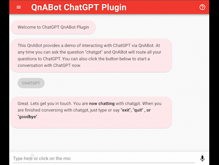

# QnABot OpenAI ChatGPT / Embeddings Plugin

## Introduction

The QnABot OpenAI ChatGPT / Embeddings Plugin provided in this project accomplishes 2 things.

1. It Lets you use OpenAI Embeddings with the latest QnABot release, for semantic FAQ matching
2. It lets you converse with chatGPT a) as a fallback to see if chatGPT knows the answer when there is no suitable FAQ in QnABot 
or B) as a specialty bot that the user can elect to converse with at any tine using QnABot's bot routing feature.



The plugin is configured with the desired ChatGPT model to use and the Embeddings model to use.
By default, "gpt-3.5-turbo" is used as the ChatGPT model and "text-embedding-ada-002" is used as the Embeddings model.
If you have a valid api key for ChatGPT 4, "gpt-4" can be used as the ChatGPT model.

This plugin can be used on on the channels supported by Amazon Lex. Web based requests and Call Center's (Amazon Connect) can 
make use of QnABot and this plugin.. 

This project provides the following:

* An easy-to-use CloudFormation template ready for deployment in the same regions supported by QnABot.
* An alternate terraform mechanism to install the AWS resources
* The project creates AWS resources: two lambda functions, a lambda layer, a dynamodb table, and two IAM roles/police.
* A sample qna json file with default questions that can be imported into QnABot designer

## Installation

### Cloudformation Template

1) Login to your AWS Account and open the AWS Cloudformation Console in the region where your QnABot is deployed
2) Create a stack with new resources
3) Specify the S3 url as https://tioth-chatgpt-plugin-resources-us-east-1.s3.us-east-1.amazonaws.com/primary.yaml and click on next
4) Give your stack a name such as "qnabot-chatgpt-plugin"
6) Change the model to an available chatgpt model if you want to use something other than 'gpt-3.5-turbo'
7) Change the embedding model to an available embedding model if you want to use something other than 'text-embedding-ada-002'
7) Change the MessageCacheExpirationInHours if needed. This is the length that a users prior messages will be maintained and sent to chatgpt as context for the current message
8) Click on next and finish launching the new stack
9) After the Stack finishes deployment open the AWS Secrets Manager console and open the secret QNA-chatgpt-openai-api-key
10) Set the secret value to your OpenaiApiKey. If you don't have an openai account or key visit https://platform.openai.com/ and setup your account
9) Download the file https://tioth-chatgpt-plugin-resources-us-east-1.s3.us-east-1.amazonaws.com/chatgpt-plugin-qna.json 
10) Import this file to QnABot using the Designer UI.
11) Modify the questions as needed.
12) ChatGPT.1 is used to initiate routing to ChatGPT. Users can say the following phrases to initiate a conversation with ChatGPT. You can modify this list in the Designer UI.
* "I'd like to speak with chatgpt",
* "I'd like to speak with chat gpt",
* "talk to chatgpt",
* "chat with chatgpt",
* "chat gpt"
13) CustomNoMatches provides the no_hits functionality and returns a Question to the user and a Button to ask if the user wants to continue chatting with ChatGPT. Selecting yes will chain to the ChatGPT.2 to continue the conversation.
14) If you don't want to use ChatGPT as a fallback mechanism to QnABot, then delete CustomNoMatches from QnABot.
15) ChatGPT.2 is used by CustomNoMatches to continue using ChatGPT after fallback has occured

### Terraform based approach

This assumes you have some familiarity with the terraform cli in a Linux environment.

1) Clone this repo
2) Create a file at the root level of this repo named "variables.tf" and add the following being sure to change the variables
for target_deployment_region, deployment_bucket_basename, message_cache_expiration_in_hours, and project. The 
target_deployment_region should be the same as where QnABot is deployed. 

```
variable "target_deployment_region" {
  type = string
  default = ""
}

variable "deployment_bucket_basename" {
  type = string
  default = ""
}

variable "message_cache_expiration_in_hours" {
  type = number
  default = 8
}

variable "project" {
  type = string
  default = "chatgpt"
}
```

3) Edit main.tf and comment out or remove all the modules which deploy to specific regions. The only active module in main.tf should be "chatgpt-plugin". The rest are not needed.
4) Setup the lambda plugin layer using the setup.sh script which calls pip to install requirements.txt

```
cd build
./setup.sh
```

```

```
5) Login via CLI to your AWS Account
6) Install via terraform

```
terraform init
terraform apply
```

7) After terraform apply finishes deployment, log into your AWS account and open the AWS Secrets Manager console. Open the secret QNA-chatgpt-openai-api-key and set the value to your OpenAI API Key. If you don't have an openai account or key visit https://platform.openai.com and setup your account
8) If you change the project variable to something other than "chatgpt" you will need to change the Lambda used in
the two questions the lambda. These are ChatGPT.1 and ChatGPT.2.
8) Import the chatgpt-plugin-qna.json to QnABot using your Designer UI.
9) Modify the questions as needed. 
10) ChatGPT.1 is used to initiate routing to ChatGPT. Users can say the following phrases to initiate a conversation with ChatGPT. You can modify this list in the Designer UI.
* "I'd like to speak with chatgpt",
* "I'd like to speak with chat gpt",
* "talk to chatgpt",
* "chat with chatgpt",
* "chat gpt"
11) CustomNoMatches provides the no_hits functionality and pops up a Question and Button for the user to ask if the user wants to continue chatting with ChatGPT. Selecting yes will chain to the ChatGPT.2 question to continue the conversation.
12) If you don't want to use ChatGPT as a fallback mechanism, then delete CustomNoMatches from QnABot.
13) ChatGPT.2 is used by CustomNoMatches. 

## Use of Embeddings
To use the newly minted, embeddings Lambda function, the QnABot CloudFormation Stack must be updated to use the embeddings lambda function. 
Update the stack and set
* EmbeddingsApi to "LAMBDA"
* EmbeddingsLambdaArn = "arn:aws:lambda:CHANGETOYOURREGION:CHANGETOYOURAWSACCOUNTID:function:QNA-chatgpt-chatgpt-embeddings"
* EmbeddingsLambdaDimensions = 1536

Once the stack update is finished, QnABot will be using Embeddings via this Lambda Function.

Visit your OpenAI account to monitor usage and cost. 

